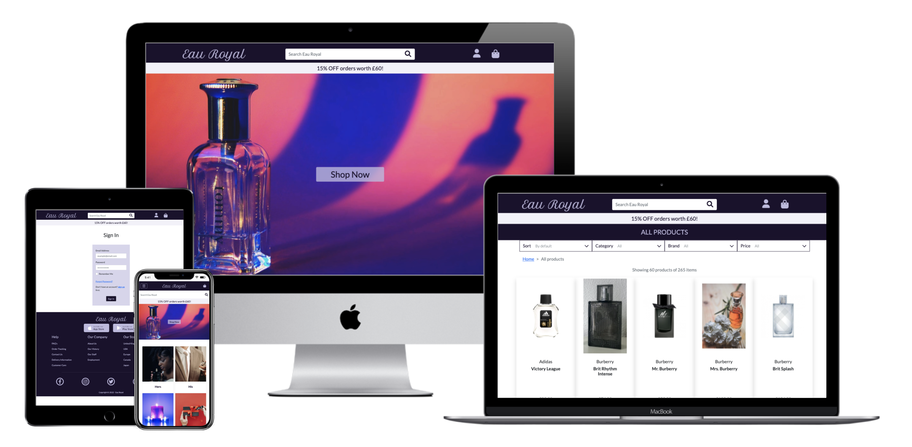
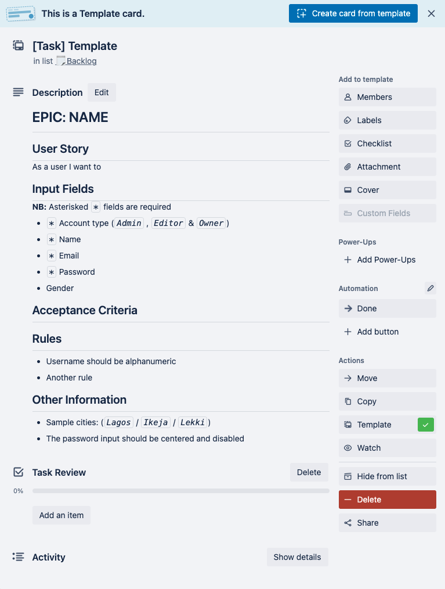
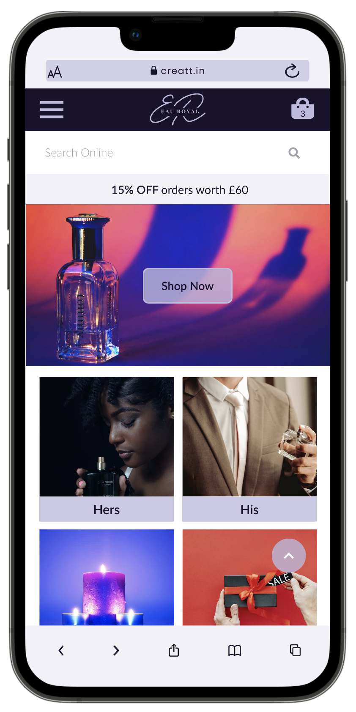
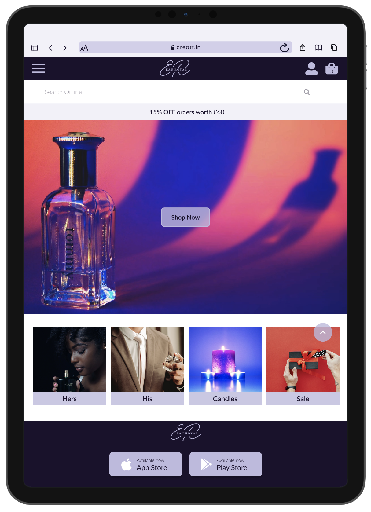
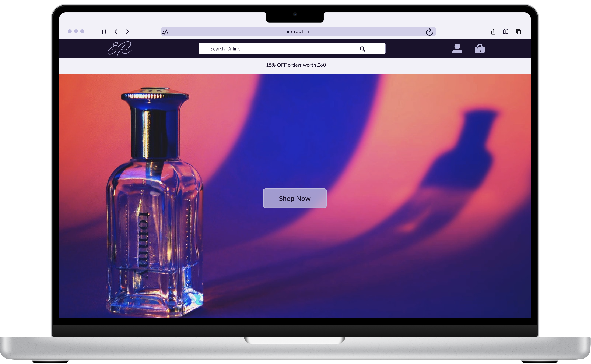
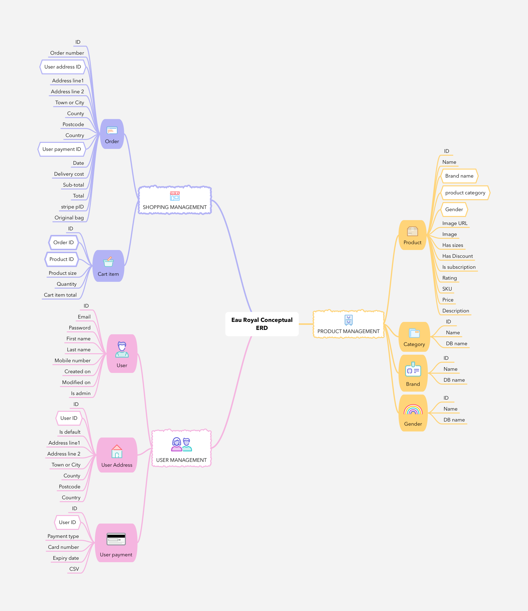
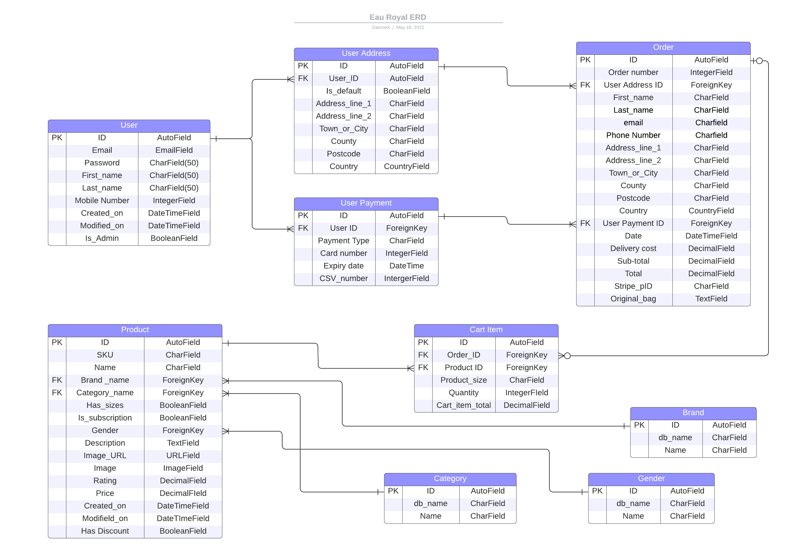
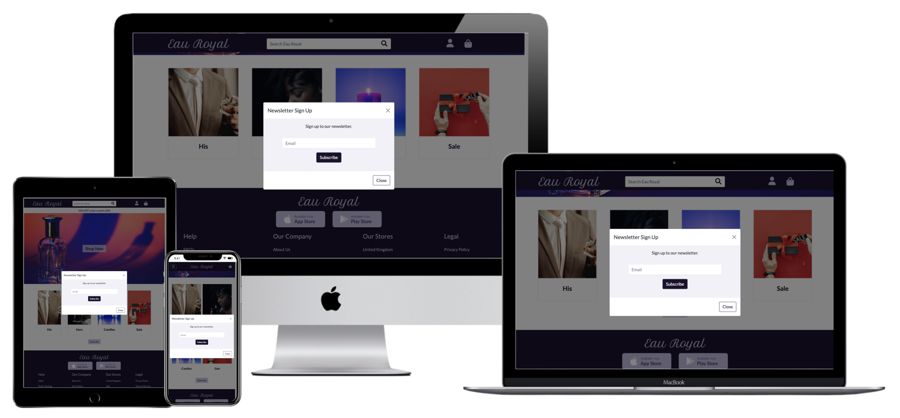
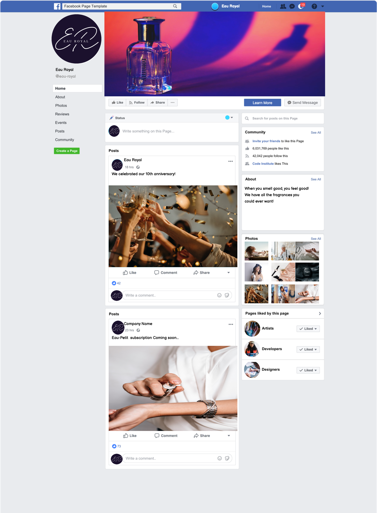

# Eau Royal

## Overview



### What is this website for?

Eau Royal is a e-commerce website that sells perfumes for all genders, and candles and to the consumer. It has two payment types, a one off payment and a subscription based payment for perfumes only.

### What does it do?

User can begin a shopping instance where they can select products they would like to by from the database. When the user is done, they can be directed to their shopping bag to view what they have and they can either start the payment process, modify/delete items or go back to the products page and add more items. When the user completes their shopping process, they will receive an email confirming their order. The User is also able to create and account to view previous purchases, change their default address and other user content.

### How does it work

Eau Royal uses the Django Python framework to generate views via HTML and CSS. JavaScript is used to make the pages interactive. JavaScript was also used to handle posting user payment securely with Stripe. All the pages are mainly styled with Bootstrap5 and custom CSS. All dependences are handled by pip and live deployment is hosted on Heroku.

[Live Website](https://eau-royal.herokuapp.com/) :point_left:

[GitHub Repository](https://github.com/datonex/eau-royal) :point_left:

## UX

### User Stories

To view user stories please follow the link to my Trello project
[User stories](https://trello.com/b/tPgicEER/eau-royal) :point_left:

To view each user story please click on each card item. Each card follows this template: where each task review is a check list and when completed will be added to the done pile.


### Design

All wireframes, mockups and prototypes were created using [Figma](https://www.figma.com) and were inspired from
The website design was inspired by the online stores [ASOS](https://www.asos.com/women/), [The Perfume Shop](https://www.theperfumeshop.com) and [The Fragrance Shop](https://www.thefragranceshop.co.uk)

#### Colour Scheme

The colour scheme used throughout the project was generated using [Coloors](https://coolors.co/ffffff-beb9df-1b112d). It was based on my favourite colour purple and the rest of the colours were randomly generated. The main colours are _White_ (#FFFFFF), _Lavender Blue_ (#BEB9DF), and _Dark Purple_ (1B112D).


When designing the wireframes and mockups the colours were expanded further based on the three main colours. The major difference is the varying level of transparency with a variation of 20%, and an introduction of 3 new accent colours, _Ghost white_ (#F2F1F9), _Lavender Web_ (#E5E2F3), _Languid Lavender_ (#CBC7E5). _Lavender Web_ and _Languid Lavender_ remain unused in the mockups


#### Wireframes

Each device will have a total of 8 distinct pages. All other components will be created from existing components in the pages. The wireframes follow the mobile first design and also follow the essential user stories.

##### _Homepage_

The homepage of each device be mostly identical. The exceptions will the image and name cards that are arranged into two rows for the mobile wireframe and one row for tablet and desktop wireframes. The search bar will be in its own section in the mobile and tablet wireframes. The search bar in the desktop version will on the header. The header will have the user icons The grey bar is the promotion banner.

  

##### _Product page_

The product page for each device mostly identical with the exception of the location of the search bar. The products list will vary in size in relation to the space available on the screen. The purple bar below the promotion banner will contain the category title

  

##### _Product Detail_

The product pages for each device will again be mostly identical. The mobile view will display each element in a list. The order will be the product title, product image, buttons, product content and lastly, product details. The tablet and desktop will follow the same order however the product image will be large and floated on the left and the product title, buttons and product content will be floated right. the product details will be placed below the two sections.

  

##### _Basket_

The shopping basket page will again be very similar and follow the same format and style. The product image will be floated on the left and the product details on the page. The user also has the option to remove, and just the quantity of the product on this page before going to the checkout page.

  

##### _Checkout_

The checkout page will have a progress meter so user know what and how many forms they will need to complete on all displays. The mobile and tablet views of the checkout page will show the basket via a prompt with a button. On the desktop version the basket will be shown on the right side as a result of more space. Redirection to edit the basket will be on this page.

  

##### _Registration_

The user registration pages will be identical across all devices and will require the user's first name, last name, email address, password, and password confirmation

  

##### _Login_

The user login page will again be identical across all devices and will require the user's email and password to login.

  

##### _User dashboard_

When the user has logged in they will access to the user dashboard, where they are able to access and view all they previous orders, change their address and personal details and also log out. The user dashboard will be displayed on multiple pages for the mobile view, where one page will display the buttons and the other will show the details related to that button. The tablet and desktop details and buttons will be displayed on the same page.

 

 

To view wireframes in another format follow the links below.

- [mobile wireframes](https://www.figma.com/file/7uNEWYjJwmXwA1KFI5E2YD/eau-royal-wireframes?node-id=3732%3A28) :point_left:

- [tablet wireframes](https://www.figma.com/file/7uNEWYjJwmXwA1KFI5E2YD/eau-royal-wireframes?node-id=3740%3A830) :point_left:

- [desktop wireframes](https://www.figma.com/file/7uNEWYjJwmXwA1KFI5E2YD/eau-royal-wireframes?node-id=3742%3A51) :point_left:

#### Typography

The font style used at mockup stage was _Lato_ from [google fonts](https://fonts.google.com/). I picked this font because the rounded character make the font easy to read. The image below illustrates the font in all weights and styles, bold, italic and regular. The actual sizes used were determined during the mockup stage.


#### Imagery

#### Mockups

- [Mobile Mockups](https://www.figma.com/file/utQzkN4QQ8UCXyWlwgoXde/eau-royal-mockup?node-id=2710%3A9005) :point_left:

- [Tablet Mockups](https://www.figma.com/file/utQzkN4QQ8UCXyWlwgoXde/eau-royal-mockup?node-id=2710%3A9006) :point_left:

- [Desktop Mockups](https://www.figma.com/file/utQzkN4QQ8UCXyWlwgoXde/eau-royal-mockup?node-id=2828%3A14368) :point_left:

#### Prototypes

The prototypes below demonstrate the intended flow of the website pages.

To view the prototypes for each device, click on the image of that device. Then interact with prototype as you would a regular online shop.

A few things to note:

- When you encounter any forms on the prototype view, assume that you have entered the correct data and click on the corresponding buttons to move on to the next page.

- All the footer links don't redirect anywhere, except for the website logo.

<a href="https://www.figma.com/proto/utQzkN4QQ8UCXyWlwgoXde/eau-royal-mockup?page-id=2710%3A9005&node-id=2733%3A10748&viewport=289%2C48%2C0.22&scaling=scale-down&starting-point-node-id=2733%3A10748"></a><a href="https://www.figma.com/proto/utQzkN4QQ8UCXyWlwgoXde/eau-royal-mockup?page-id=2710%3A9006&node-id=2812%3A17405&viewport=289%2C48%2C0.07&scaling=scale-down&starting-point-node-id=2812%3A17405"></a><a href="https://www.figma.com/proto/utQzkN4QQ8UCXyWlwgoXde/eau-royal-mockup?page-id=2828%3A14368&node-id=2828%3A14560&viewport=289%2C48%2C0.34&scaling=scale-down&starting-point-node-id=2828%3A14560"></a>

### Database

#### Conceptual ERD



Key

- Hexagonal items are foreign key fields

- Line items are generic model fields

- Filed in nodes are model names

#### Physical ERD



### Existing Features

#### Common Features Across All Pages

- [x] **Header** - allows user to easily navigate across all pages

- Header is fixed to top of page for easy access (desktop and large tablets)

- and text are positioned on the left and are links that take you to the homepage

- Navigation is place on the right on the logo for easy access (under logo for mobile)

- Navigation links change colour when hovered over. This lets the visitor know that it is clickable.

- Navigation link is underlined to let user know what page they are on

- Entire header disappears for mobile devices

- Colors have been chosen with optimum contrast in mind to be pleasant to the eye.

- [x] **Links** that are hovered over

- All links that are surrounding text have been underlined and change color when hovered over. This helps the user to identify external links.

- [x] **Navigation banner**

- Navigation banner is the same across all pages to give uniformity and familiarity

- background image on home is scrollable to give a more fun user experience

- [x] **Accessibility**

- All images have aria labels in case they don't load and for the visually impaired

- [x] **Buttons**

- All buttons have the same styling and they invert colours when hovered (except for scroll to top button)

- [x] **Responsiveness**

- All pages work well with many screen sizes

- [x] **Footer**

- Footer sticks to the bottom of the page, regardless of the amount of content. This aids the overall user experience.

- All content have near uniform layout to give a nice and engaging flow of text and images

- Social links have been grouped together

#### Specific to Pages

- [x] **Home Page**

### Features Left to Implement

(See Trello cards)

- [ ] Subscription model payment for members

- [x] Form authentication at checkout before user is directed to next payment flow

- [x] Form Validation when entering phone numbers, valid zip/post codes and user enters more than one name at frontend

- [ ] Form Validation when entering phone numbers, valid zip/post codes and user enters more than one name at backend

- [ ] Allow user to add multiple addresses to their profile

- [ ] Allow users to save their card information for a faster checkout

- [ ] Some product images are mismatched

- [ ] Some product images are missing and or rendering incorrectly

- [ ] Add page title for ALL pages

- [ ] Admin panel that allows shop owners to send emails to all users that are subscribed to Eau Royal

- [ ] Create a stock manager database and users are shown if certain items are out of stock. If users want to be notified when it will be back in stock, they can enter their email address directly from product detail page.

- [ ] Automatically generate SKU number when creating a new product

- [ ] At bottom of product detail page, show users perfumes/products that smell similar to the one currently being viewed.

- [ ] Allow logged in users to save a perfume/product to a which list so that they can save buy it/ access it later. non-members redirected to sign in/register

### Marketing Information

Users have the option to sign up to Eau-Royal's newsletter at the home page so that they can receive news about any new products, special offers and events.



The Eau Royal facebook page will have the following mock details and posts



## Technologies Used

### Languages used

- [HTML](https://en.wikipedia.org/wiki/HTML5) - Add content and formatting to web page.
- [CSS](https://en.wikipedia.org/wiki/CSS) - Add styling and colours to web page.
- [JavaScript](https://www.javascript.com/) - Add interactive features to web page

- [Python](https://www.python.org/) - Add code to allow app to access database.

### Frameworks, Libraries and Programs Used

- [Visual Studio Code](https://code.visualstudio.com/) - Source-code editor optimised for debugging, testing, syntax highlighting and extension support

- [Git](https://git-scm.com/) - used to allow for tracking of any changes in the code and for the version control.

- [Github](https://github.com/) - used to host the project files

- [Heroku](https://heroku.com/) - used to deploy web application

- [Postgres](https://postgresapp.com/) - used as the DBMS to store user profile data and hosted on Heroku

- [Figma](https://www.figma.com/) - used to create wireframes mockups and prototypes

- [Creatt Studios](https://www.figma.com/@creatt) - component template to illustrate mockups

- [Google Sheets](https://docs.google.com/spreadsheets/) - Tabulate user stories

- [Zapier](https://www.zapier.com/) - Automate process of adding user stories from google sheets to Trello

- [Trello](https://trello.com/) - Agile tool of choice to manage and plan web app.

- [MindNode](https://www.mindnode.com/) - app used to draw mind maps to show entities and their attributes.

- [Lucid Chart](https://www.lucidchart.com/) - web app use to illustrated database schema.

- [Canva](https://www.canva.com/) - webapp used to design logo and favicon.

- [Django](https://www.djangoproject.com/) - Python web framework to create web application and provide security to users.

- [Fontawesome](https://fontawesome.com/) - to insert icons in the website to make site more visually appealing and easy to navigate.

- [Favicon.io](https://favicon.io/) - used to generate favicon to webpage

- [Google Fonts](https://fonts.google.com/) - used to import fonts in the style.css stylesheet.

- [TinyPNG](https://tinypng.com/) - used to reduce resolution of images

- [Bootstrap](https://getbootstrap.com/) - Used for the responsive layout as well as custom components such as image carousel, navigation bar, footer, cards, and collapse element.

- [jquery](https://jquery.com/) - Used in some of the clickable elements such as collapsible 'hamburger' nav bar and collapse element.

- [popper.js](https://popper.js.org/) - Used in some of the clickable elements such as collapsible 'hamburger' navbar and collapse element.

- [Waypoint](http://imakewebthings.com/waypoints/) - Used ad infinite scrolling function to posts

- [Stripe](https://stripe.com) - Handle secure payments for users

- [AWS](https://aws.amazon.com) - Host static files for page

- [Django url tools](https://github.com/kbuzsaki/django-url-tools-py3) - used to handle urls when searching for products

- [XML-Sitemaps](https://www.xml-sitemaps.com/) - used to generate Eau Royal Sitemap

## Testing

In this section, you need to convince the assessor that you have conducted enough testing to legitimately believe that the site works well. Essentially, in this part you will want to go over all of your user stories from the UX section and ensure that they all work as intended, with the project providing an easy and straightforward way for the users to achieve their goals.

Whenever it is feasible, prefer to automate your tests, and if you've done so, provide a brief explanation of your approach, link to the test file(s) and explain how to run them.

For any scenarios that have not been automated, test the user stories manually and provide as much detail as is relevant. A particularly useful form for describing your testing process is via scenarios, such as:

### Code Validation

####  HTML5 Validator

Code validation with [W3C Validator](https://validator.w3.org/)

##### Bag App

- **bag.html** --> :white_check_mark: pass

##### Checkout App

- **checkout.html** --> :white_check_mark: pass

- **checkout_success.html** --> :white_check_mark: pass

##### Home App

- **index.html** --> :white_check_mark: pass

##### Products App

- **products.html** --> :white_check_mark: pass

- **product_detail.html** --> :white_check_mark: pass

- **add_product.html** --> :white_check_mark: pass

- **edit_product.html** --> :white_check_mark: pass

- **default_sorting.html** --> :white_check_mark: pass

- **mobile_sorting.html** --> :white_check_mark: pass

- **custom_clearable_file_input.html** --> :white_check_mark: pass

##### Profiles App

- **profile.html** --> :white_check_mark: pass

- **profile_mobile.html** --> :white_check_mark: pass

- **profile_address.html** --> :white_check_mark: pass

- **profile_details.html** --> :white_check_mark: pass

- **profile_details.html** --> :white_check_mark: pass

##### Base files

- **base.html** --> :white_check_mark: pass

  - :x:

####  CSS Validator

Code validation with [W3C CSS Validator](https://jigsaw.w3.org/css-validator/)

##### Bag App

- **bag.css** --> :white_check_mark: pass

  - 4 :warning: Warnings

  | Line | Warning text                                                      |
  | ---: | ----------------------------------------------------------------- |
  |   24 | `::-webkit-outer-spin-button` is a vendor extended pseudo-element |
  |   25 | `::-webkit-inner-spin-button` is a vendor extended pseudo-element |
  |   26 | `-webkit-appearance` is a vendor extension                        |
  |   33 | `-moz-appearance` is a vendor extension                           |

##### Checkout App

- **checkout.css** --> :white_check_mark: pass

##### Home App

- **home.css** --> :white_check_mark: pass

##### Products App

- **products.css** --> :white_check_mark: pass

  - 11 :warning: Warnings

  | Line | Selector/s                         | Warning text                                                      |
  | ---- | ---------------------------------- | ----------------------------------------------------------------- |
  | 24   | .btn-checkbox                      | Same color for `background-color` and `border-color`              |
  | 31   | .btn-checkbox:hover                | Same color for `background-color` and `border-color`              |
  | 41   | .btn-check:active + .btn-checkbox  | Same color for `background-color` and `border-color`              |
  | 41   | .btn-check:checked + .btn-checkbox | Same color for `background-color` and `border-color`              |
  | 41   | .btn-checkbox.active               | Same color for `background-color` and `border-color`              |
  | 41   | .btn-checkbox.dropdown-toggle.show | Same color for `background-color` and `border-color`              |
  | 41   | .btn-checkbox:active               | Same color for `background-color` and `border-color`              |
  | 47   |                                    | `::-webkit-outer-spin-button` is a vendor extended pseudo-element |
  | 48   |                                    | `::-webkit-inner-spin-button` is a vendor extended pseudo-element |
  | 49   |                                    | `-webkit-appearance` is a vendor extension                        |
  | 56   |                                    | `-moz-appearance` is a vendor extension                           |

##### Profiles App

- **profile.css** --> :white_check_mark: pass

##### Base files

- **constants.css** --> :white_check_mark: pass

- **base.css** --> :white_check_mark: pass

  - 19 :warning: Warnings

  | Line | Selector/s                                                                       | Warning text                                         |
  | ---- | -------------------------------------------------------------------------------- | ---------------------------------------------------- |
  | 71   | `.btn-dp`                                                                        | Same color for `background-color` and `border-color` |
  | 77   | `.btn-dp:hover`                                                                  | Same color for `background-color` and `border-color` |
  | 88   | `.btn-outline-dp:hover`                                                          | Same color for `background-color` and `border-color` |
  | 98   | `.btn-check:active + .btn-outline-dp`                                            | Same color for `background-color` and `border-color` |
  | 98   | `.btn-check:checked + .btn-outline-dp`                                           | Same color for `background-color` and `border-color` |
  | 98   | `.btn-outline-dp.active`                                                         | Same color for `background-color` and `border-color` |
  | 98   | `.btn-outline-dp.dropdown-toggle.show`                                           | Same color for `background-color` and `border-color` |
  | 98   | `.btn-outline-dp:active`                                                         | Same color for `background-color` and `border-color` |
  | 104  | `.btn-nav-dp`                                                                    | Same color for `background-color` and `border-color` |
  | 111  | `.btn-nav-dp:hover`                                                              | Same color for `background-color` and `border-color` |
  | 121  |                                                                                  | Same color for `background-color` and `border-color` |
  | 147  | `.btn-check:active + .btn-outline-lv`                                            | Same color for `background-color` and `border-color` |
  | 147  | `.btn-check:checked + .btn-outline-lv`                                           | Same color for `background-color` and `border-color` |
  | 147  | `.btn-outline-lv.active`                                                         | Same color for `background-color` and `border-color` |
  | 147  | `.btn-outline-lv.dropdown-toggle.show`                                           | Same color for `background-color` and `border-color` |
  | 147  | `.btn-outline-lv:active`                                                         | Same color for `background-color` and `border-color` |
  | 187  | `.list-group-item.active-custom`                                                 | Same color for `background-color` and `border-color` |
  | 329  |                                                                                  | `-webkit-transition` is a vendor extension           |
  | 368  | `.custom-checkbox .custom-control-input:checked ~ .custom-control-label::before` | Same color for `background-color` and `border-color` |

####  JavaScript Validator

Code validation with [JSHint](https://jshint.com/)

##### Bag App

- **bag embedded js** --> :white_check_mark: pass

  - :chart_with_upwards_trend: Metrics

    - There are 6 functions in this file.

    - Function with the largest signature takes 2 arguments, while the median is 0.5.

    - Largest function has 9 statements in it, while the median is 2.5.

    - The most complex function has a cyclomatic complexity value of 2 while the median is 1.

##### Checkout App

- **stripe_element.js** --> :white_check_mark: pass

  - :chart_with_upwards_trend: Metrics

    - There are 5 functions in this file.

    - Function with the largest signature takes 1 arguments, while the median is 1.

    - Largest function has 10 statements in it, while the median is 5.

    - The most complex function has a cyclomatic complexity value of 3 while the median is 1.

  - :shrug: Undefined variables

    - Stripe - variable is imported directly in checkout.html and is working as intended.

- **checkout_script embedded js** --> :white_check_mark: pass

  - :chart_with_upwards_trend: Metrics

    - There are 9 functions in this file.

    - Function with the largest signature takes 0 arguments, while the median is 0.

    - Largest function has 33 statements in it, while the median is 4.

    - The most complex function has a cyclomatic complexity value of 8 while the median is 1.

##### Products App

- **product_detail embedded js** --> :white_check_mark: pass

  - :chart_with_upwards_trend: Metrics

    - There are 5 functions in this file.

    - Function with the largest signature takes 1 arguments, while the median is 0.

    - Largest function has 7 statements in it, while the median is 1.

    - The most complex function has a cyclomatic complexity value of 1 while the median is 1.

- **add_product embedded js** --> :white_check_mark: pass

  - :chart_with_upwards_trend: Metrics

    - There is only one function in this file.

    - It takes no arguments.

    - This function contains 2 statements.

    - Cyclomatic complexity number for this function is 1.

- **products_script embedded js** --> :white_check_mark: pass

  - :chart_with_upwards_trend: Metrics

    - There are 7 functions in this file.

    - Function with the largest signature takes 2 arguments, while the median is 0.

    - Largest function has 10 statements in it, while the median is 6.

    - The most complex function has a cyclomatic complexity value of 3 while the median is 1.

  - 8 :zzz: Unused variables

    - infinite

    - sortPriceAscMobile

    - sortPriceDescMobile

    - sortRatingDescMobile

    - sortPriceAsc

    - sortPriceDesc

    - sortRatingDesc

    - handleDirection

    - All the unused variables pointed out by JSHint are used directly in the html file and have been manually checked that they are working correctly.

  - 1 :shrug: Undefined variable

    - Waypoint - The waypoint variable is defined in the import Waypoint.js static file and is working as intended.

- **quantity_input embedded js** --> :white_check_mark: pass

  - 7 :warning: Warnings

    | Line | Warning text                            |
    | ---- | --------------------------------------- |
    | 12   | `currentValue` is already defined.      |
    | 15   | `currentValue` used out of scope.       |
    | 16   | `currentValue` used out of scope.       |
    | 51   | `allQuantityInputs` is already defined. |
    | 54   | `allQuantityInputs` used out of scope.  |
    | 67   | `allQuantityInputs` is already defined. |
    | 70   | `allQuantityInputs` used out of scope.  |

  - :chart_with_upwards_trend: Metrics

    - There are 5 functions in this file.

    - Function with the largest signature takes 2 arguments, while the median is 1.

    - Largest function has 10 statements in it, while the median is 10.

    - The most complex function has a cyclomatic complexity value of 3 while the median is 2.

##### Profiles App

- **profile embedded js** --> :white_check_mark: pass

  - :chart_with_upwards_trend: Metrics

    - There are 7 functions in this file.

    - Function with the largest signature takes 0 arguments, while the median is 0.

    - Largest function has 10 statements in it, while the median is 7.

    - The most complex function has a cyclomatic complexity value of 1 while the median is 1.

####  Python Validator

Code validation with [pep8online](http://pep8online.com/)

##### Eau Royal Project

- **settings.py** --> :x: failed

  | Code Error | Line | Error text                         |
  | ---------- | ---- | ---------------------------------- |
  | E505       | 149  | line too long (91 > 79 characters) |
  | E505       | 152  | line too long (81 > 79 characters) |
  | E505       | 155  | line too long (82 > 79 characters) |
  | E505       | 158  | line too long (83 > 79 characters) |

  All E505 errors were not fixed because they will compromise readability of django settings file

- **urls.py** --> :white_check_mark: pass

##### Misc files

- custom_storages.py --> :white_check_mark: pass

##### Bag App

- **contexts.py** --> :white_check_mark: Pass

- **urls.py** --> :white_check_mark: pass

- **views.py** --> :white_check_mark: pass

##### Checkout App

- **admin.py** --> :white_check_mark: pass

- **apps.py** --> :white_check_mark: pass

- **forms.py** --> :white_check_mark: pass

- **models.py** --> :white_check_mark: pass

- **signals.py** --> :white_check_mark: pass

- **urls.py** --> :white_check_mark: pass

- **views.py** --> :white_check_mark: pass

- **webhook_handler.py** --> :white_check_mark: pass

- **webhooks.py** --> :white_check_mark: pass

##### Home App

- **admin.py** --> :white_check_mark: pass

- **forms.py** --> :white_check_mark: pass

- **models.py** --> :white_check_mark: pass

- **urls.py** --> :white_check_mark: pass

- **views.py** --> :white_check_mark: pass

##### Products App

- **admin.py** --> :white_check_mark: pass

- **forms.py** --> :white_check_mark: pass

- **models.py** --> :white_check_mark: pass

- **signals.py** --> :white_check_mark: pass

- **urls.py** --> :white_check_mark: pass

- **views.py** --> :white_check_mark: pass

  - I have omitted the `W503 line break before binary operator` warnings in **views.py** from this documentation because the [pep8 documentation](https://peps.python.org/pep-0008/#should-a-line-break-before-or-after-a-binary-operator) recommends line break BEFORE binary operators for new code.

- **widgets.py** --> :white_check_mark: pass

##### Profiles App

- **forms.py** --> :white_check_mark: pass

- **models.py** --> :white_check_mark: pass

- **urls.py** --> :white_check_mark: pass

- **views.py** --> :white_check_mark: pass

##### Tests folder

- **test_admin.py** --> :white_check_mark: pass

- **test_anon_user.py** --> :white_check_mark: pass

- **test_user.py** --> :white_check_mark: pass

### Software Tests

The testing method used in this project were done using behaviour driven development technique. Most of the major features were tested automatically such as registering a new user or creating a new shopping instance. Other features like testing if the user if able to select filters needed to manually tested.

The automatic testing software used in this project is the [Selenium IDE](https://www.selenium.dev/selenium-ide/) Chrome extension. The IDE is also available on the Firefox browser. The chrome extension requires a chrome driver in order to run the tests can be found [here](https://chromedriver.chromium.org/downloads?tmpl=/system/app/templates/print/&showPrintDialog=1). The driver must be saved in the virtual environment `.venv/bin` folder. The required packages for the tests to run can be found installed by following the steps in [contribution section](#Contribution) otherwise install them manually using the command `pip3 install pytest selenium`.

Before running the tests, create a `test_env.py` file in root project directory with following variables:

```python
# Admin test variables
os.environ["ADMIN_USERNAME"] = "admin_username"
os.environ["ADMIN_EMAIL"] = "admin_email@example.com"
os.environ["ADMIN_PASSWORD"] = "admin_password"

# Member test variables
os.environ["USERNAME"] = "username"
os.environ["EMAIL"] = "user@example.com"
os.environ["PASSWORD"] = "password2"
os.environ["FIRST_NAME"] = "first_name"
os.environ["LAST_NAME"] = "last_name"
os.environ["FULL_NAME"] = "first_name last_name"
os.environ["PHONE_NUMBER"] = "0123456789"
os.environ["ADDRESS_LINE_1"] = "12 Street Name"
os.environ["TOWN"] = "Paris"
os.environ["COUNTRY"] = "France"
os.environ["CARD_NUMBER"] = "4000002500000003"
os.environ["EXPIRY_DATE"] = "04 / 24"
os.environ["CVC"] = "123"

os.environ["TEST_FIRST_NAME"] = "Joey"
os.environ["TEST_LAST_NAME"] = "Kangaroo"
os.environ["TEST_FULL_NAME"] = "Joey Kangaroo"
os.environ["TEST_EMAIL"] = "joeyk@mail.com"
os.environ["TEST_PHONE_NUMBER"] = "0123456789"
os.environ["TEST_ADDRESS_LINE_1"] = "12 Random Crescent"
os.environ["TEST_TOWN"] = "Liverpool"
os.environ["TEST_COUNTRY"] = "United Kingdom"
os.environ["TEST_CARD_NUMBER"] = "4000008260000000"
os.environ["TEST_EXPIRY_DATE"] = "04 / 24"
os.environ["TEST_CVC"] = "123"
os.environ["TEST_POSTAL_CODE"] = "L14 3LB"
```

#### EPIC: User Accounts and Registration

| Test type | User Story                                                                                                                 | Expected result                                                                                                                                                                                                                                                                                                                                                                                             | Pass :white_check_mark: / Fail :x: |
| --------- | -------------------------------------------------------------------------------------------------------------------------- | ----------------------------------------------------------------------------------------------------------------------------------------------------------------------------------------------------------------------------------------------------------------------------------------------------------------------------------------------------------------------------------------------------------- | ---------------------------------- |
| Automatic | As an anonymous user I want to be able to register for an account so that I can view my details in a profile               | User can input their data to register for an account.<br>When form is submitted the user is prompted to verify their email address.                                                                                                                                                                                                                                                                         | :white_check_mark:                 |
| Automatic | As a User/Admin/Staff I want to be able to login so that I can access my account information                               | User/admin/staff can logs in with their email address and password.<br>If user account exists, the user will be redirected to the home page and will receive a notification that says they have logged in.<br>Their username will be printed in the notification                                                                                                                                            | :white_check_mark:                 |
| Automatic | As a User/Admin/Staff I want to be able to logout so that I can prevent someone else from accessing my account information | When user/staff/member clicks the sign out, they are prompted if they want to complete the action.<br>If yes, the user is signed out and they will receive a success message when sign out is complete                                                                                                                                                                                                      | :white_check_mark:                 |
| Automatic | As a User I want to have a personal user profile so that I view my order history and change personal information           | When user is logged in, they have access to the 'My Profile' link. This will redirected them to their profile page.<br>The user is able to view the following:<br><br>- order history<br>- default address<br>- personal information <br>- link to reset their password<br>- link to change email address                                                                                                   | :white_check_mark:                 |
| Manual    | As User I want to be able to recover my password in case I forget it so that I can get back access to my account.          | When user is on login page, They have access to reset password link where they will directed to the reset password page.<br>Here they can input their email submit the form.<br>They will receive a link that will direct them to the reset password page.<br>They will input their new password, confirm it and then submit the form.<br>User will be redirected to login page and login with new password | :white_check_mark:                 |

#### EPIC: Admin and Store Management

| Test type | User Story                                                                                                                                      | Expected result                                                                                                                                                                                                                                                                                                      | Pass ✅ / Fail :x: |
| --------- | ----------------------------------------------------------------------------------------------------------------------------------------------- | -------------------------------------------------------------------------------------------------------------------------------------------------------------------------------------------------------------------------------------------------------------------------------------------------------------------- | ------------------ |
| Automatic | As STAFF/ADMIN I want to be able to add a product to the store so that my customers can purchase the new items.                                 | Shop staff/admin can create a new product. <br> When product is submitted to database, the staff/admin is redirected to the new product item. <br> Staff/admin will receive a notification that the product was created successfully.                                                                                | :white_check_mark: |
| Automatic | As STAFF/ADMIN I want to be able to edit/update a product in the store so that my customers can purchase the new items with correct information | Shop staff/admin can edit a product already saved in the database. <br> All input fields with required data should already be pre-field. <br> When product is submitted to database, the staff/admin is redirected to the edited product item and receive a notification that the product was modified successfully. | :white_check_mark: |
| Automatic | As STAFF/ADMIN I want to be able to delete a product so that I can remove items no longer for sale.                                             | Shop staff/admin can delete a product already saved in the database. <br> All input fields with required data should already be pre-field. <br> When product is submitted to database, the staff/admin is redirected to the homepage and receive a notification that the product was modified successfully.          | :white_check_mark: |

#### EPIC: Viewing and Navigation

| Test type          | User Story                                                                                                                          | Expected result                                                                                                                                                                                                                                                                               | Pass :white_check_mark: / Fail :x: |
| ------------------ | ----------------------------------------------------------------------------------------------------------------------------------- | --------------------------------------------------------------------------------------------------------------------------------------------------------------------------------------------------------------------------------------------------------------------------------------------- | ---------------------------------- |
| Manual + Automatic | As User I want to be able to view a list of products so that I can choose some to purchase.                                         | All user are able to view a list of products when they navigate to [products](https://eau-royal.herokuapp.com/products/) page.                                                                                                                                                                | :white_check_mark:                 |
| Manual + Automatic | As User I want to be able to view the total of my purchases so that I avoid spending too much money                                 | User can see the total of their purchase during following conditions:<br>- add a product to the basket<br>- edit product quantity from product detail page<br>- edit product quantity from bag page<br>- delete product when the basket window is active<br>- delete product when on bag page | :white_check_mark:                 |
| Manual             | As User I want to be able to view individual product details so that I view the price, description, size, product rating and image. | When user clicks the image card, user is directed to product detail page of specific product                                                                                                                                                                                                  | :white_check_mark:                 |

#### EPIC: Sorting and Searching

| Test type          | User Story                                                                                                                       | Expected result                                                                                                                                                                                                                                                                                                                        | Pass :white_check_mark: / Fail :x: |
| ------------------ | -------------------------------------------------------------------------------------------------------------------------------- | -------------------------------------------------------------------------------------------------------------------------------------------------------------------------------------------------------------------------------------------------------------------------------------------------------------------------------------- | ---------------------------------- |
| Manual             | As User I want to be able to sort/filter products so that I can easily identify products by price and product                    | - Select price range<br>- Select multiple brand checkbox<br>- Select either Candle or perfume product type.<br>- Select one of gender (His, Hers or Unisex)<br>- Product type and gender can be selected at the same time<br>- All filters can be sorted by either ascending price, descending price, or descending rating at one time | :white_check_mark:                 |
| Automatic + Manual | As a user I want to be able to search products by name or description so that I can find a specific product I would like to buy. | User types search query in search bar (all devices) they can see their search results and how many items were found                                                                                                                                                                                                                    | :white_check_mark:                 |

#### EPIC: Purchasing and Checkout

| Test type | User Story                                                                                                                   | Expected result                                                                                      | Pass :white_check_mark: / Fail :x: |
| --------- | ---------------------------------------------------------------------------------------------------------------------------- | ---------------------------------------------------------------------------------------------------- | ---------------------------------- |
| Automatic | As a user I want to easily select the size and quantity of a product when purchasing it so that I purchase the right product | - Select product size from product detail page<br>- Select product quantity from product detail page | :white_check_mark:                 |
| Automatic | As a user I want to easily select the quantity of a product before I checkout                                                | - Select product quantity from bag page                                                              | :white_check_mark:                 |
| Automatic | As a user I want to receive an email confirmation after checkout so that I can have a record of what I purchased             | - Send email to user once order is complete                                                          | :x:                                |
| Automatic | As a user I want to enter my payment details so that I can checkout easily and receive my items                              | - User can enter their card detail at checkout page                                                  | :white_check_mark:                 |
| Automatic | As a user I want to be able to view my items in a bag so that I can see the total amount to be purchased                     | - User has access to bag items once a product is added to the basket                                 | :white_check_mark:                 |

### Compatibility Testing

- Browser Compatibility

  | Screen size\Browser |       Safari       |    Opera    | Microsoft Edge |       Chrome       |      Firefox       | Internet Explorer |
  | ------------------- | :----------------: | :---------: | :------------: | :----------------: | :----------------: | :---------------: |
  | Mobile              | :heavy_check_mark: | Not Tested  |  Not Tested.   | :heavy_check_mark: | :heavy_check_mark: |    Not Tested     |
  | Desktop             | :heavy_check_mark: | Not Tested. |  Not Tested.   | :heavy_check_mark: | :heavy_check_mark: |    Not Tested     |
  | Tablet              | :heavy_check_mark: | Not Tested. |  Not Tested.   | :heavy_check_mark: | :heavy_check_mark: |    Not Tested     |

- OS Compatibility was tested on iOS 14.5.1, MacOS Catalina, iPadOS 14.5 It is yet to be tested on Unix, Linux, Windows or Solaris Operating Systems.
- The devices used in this testing include MacBook Pro, iPad Pro, iPhone 12 Pro Max, iPhone 7 Plus, Samsung S10

- The website was exhaustively tested for responsiveness on [Chrome DevTools](https://developers.google.com/web/tools/chrome-devtools). Different viewport sizes were simulated ranging from as small as iPhone 4 (320px) to large desktop sizes (1200px and above).

### Bugs

- [x] Sorting only allows items determined by link, user are unable to select multiple queries. However multiple queries work if manually typed into the browser.

- [x] Checkout bug - client stripe instance not being created on GET method sometimes

## Deployment

This website was published using [Heroku](https://heroku.com/).

### Deployment to Heroku

### Contribution

1. Firstly you will need to clone this repository by running the `git clone <https://github.com/datonex/eau-royal/>` command
2. If using VS Code type make sure you have th Git extension installed then type about code into your terminal
3. Navigate to project folder and start a virtual environment with `python3 -m venv .venv`
4. Activate you virtual environment with `source .venv/bin/activate`
5. Install dependencies with `pip install -r requirements.txt`
6. Make changes to the code and if you think it belongs in here then submit a pull request

## Credits

### Dependencies + code snippets

- Django documentation - [Django](https://docs.djangoproject.com/en/3.2/)

- Landing page template - [startbootstrap](https://github.com/startbootstrap/startbootstrap-scrolling-nav)
- Javascript media queries - [w3schools](https://www.w3schools.com/howto/howto_js_media_queries.asp)

- Autocomplete form attributes - [htmlspec](https://html.spec.whatwg.org/multipage/form-control-infrastructure.html#autofilling-form-controls%3A-the-autocomplete-attribute)

- Hide input spinners - [w3schools](https://www.w3schools.com/howto/howto_css_hide_arrow_number.asp)

- Waypoints infinite scroll - [ImakeWebThings](http://imakewebthings.com/waypoints/)

- Catch exception type - [Stack overflow](https://stackoverflow.com/questions/32394032/the-best-way-to-determine-exception-type)

- Get min and max value of a field - [Stack overflow](https://stackoverflow.com/questions/844591/how-to-do-select-max-in-django)

- JS range slider - [Ion range slider](http://ionden.com/a/plugins/ion.rangeSlider/index.html)

- Checkboxes that behave like radio buttons - [Stack overflow](https://stackoverflow.com/questions/5839884/make-checkbox-behave-like-radio-buttons-with-javascript)

- Code Institute Boutique Ado lessons

- Add custom error pages [Stack overflow](https://stackoverflow.com/questions/17662928/django-creating-a-custom-500-404-error-page)

- Error 404 page - [Omar Dsooky](https://codepen.io/linux/pen/OjmeKP)

- Error 500 page - [Christopher Kirk-Nielsen](https://codepen.io/chriskirknielsen/pen/pOLdVG)

- Django url parameters Documentation - [Bitbucket](https://bitbucket.org/monwara/django-url-tools/src/master/#rst-header-overview)

- International dialing codes to generate regex for phone numbers - [Iban](https://www.iban.com/dialing-codes)

- Regex tester - [Regexr](https://regexr.com/)

- Regex generator - [Regex-generator](https://regex-generator.olafneumann.org/)

- Checkbox filtering -[Reddit](https://www.reddit.com/r/django/comments/i80npw/checkbox_filtering/)

### Content

- [noon perfume | Kaggle](https://www.kaggle.com/monirahabdulaziz/noon-perfume?select=read.me.txt)

- [Fragrances of the World - Discover Michael Edwards’ world of fragrances](http://www.fragrancesoftheworld.com/)

#### Images

- README programming language icons - [Devicon](https://devicon.dev/)

- Product images - [Parfumo](https://www.parfumo.net/)

- Images query - [Best Spray Bottle | Pexels Stock Photos](https://www.pexels.com/search/spray%20bottle/)
  Hero image - Photo by [George Becker](https://www.pexels.com/@eye4dtail?utm_content=attributionCopyText&utm_medium=referral&utm_source=pexels) from [Pexels](https://www.pexels.com/photo/clear-glass-bottle-136651/?utm_content=attributionCopyText&utm_medium=referral&utm_source=pexels)

- Candles category - Photo by [George Becker](https://www.pexels.com/@eye4dtail?utm_content=attributionCopyText&utm_medium=referral&utm_source=pexels) from [Pexels](https://www.pexels.com/photo/three-lighted-candles-360209/?utm_content=attributionCopyText&utm_medium=referral&utm_source=pexels)

- His category home page - Photo by [Duané Viljoen](https://www.pexels.com/@duane-viljoen-3411736?utm_content=attributionCopyText&utm_medium=referral&utm_source=pexels) from [Pexels](https://www.pexels.com/photo/man-wearing-suit-and-necktie-with-perfume-bottle-10604607/?utm_content=attributionCopyText&utm_medium=referral&utm_source=pexels)

- Hers category home page - Photo by [Abstract Photos](https://www.pexels.com/@abstract-photos-49564378?utm_content=attributionCopyText&utm_medium=referral&utm_source=pexels) from [Pexels](https://www.pexels.com/photo/close-up-shot-of-an-afro-haired-woman-holding-a-perfume-bottle-8323833/?utm_content=attributionCopyText&utm_medium=referral&utm_source=pexels)

- salve category homepage - Photo by [Max Fischer](https://www.pexels.com/@max-fischer?utm_content=attributionCopyText&utm_medium=referral&utm_source=pexels) from [Pexels](https://www.pexels.com/photo/person-holding-red-and-black-box-with-red-ribbon-5872354/?utm_content=attributionCopyText&utm_medium=referral&utm_source=pexels)

- Profile hero image - Photo by [Egor Kamelev](https://www.pexels.com/@ekamelev?utm_content=attributionCopyText&utm_medium=referral&utm_source=pexels) from [Pexels](https://www.pexels.com/photo/jellyfish-digital-wallpaper-753267/?utm_content=attributionCopyText&utm_medium=referral&utm_source=pexels)

- Subscription hero image - Photo by [Jill Burrow](https://www.pexels.com/@jill-burrow?utm_content=attributionCopyText&utm_medium=referral&utm_source=pexels) from [Pexels](https://www.pexels.com/photo/an-alphabet-made-of-purple-flower-petals-7400308/?utm_content=attributionCopyText&utm_medium=referral&utm_source=pexels)

- Subscription box image - Photo by [Karolina Grabowska](https://www.pexels.com/@karolina-grabowska?utm_content=attributionCopyText&utm_medium=referral&utm_source=pexels) from [Pexels](https://www.pexels.com/photo/gift-in-pink-box-with-scattered-petals-around-4041329/?utm_content=attributionCopyText&utm_medium=referral&utm_source=pexels)

- Subscription spray bottle with hands - Photo by [Babi Galeane](https://www.pexels.com/@babi-galeane-58498777?utm_content=attributionCopyText&utm_medium=referral&utm_source=pexels) from [Pexels](https://www.pexels.com/photo/unrecognizable-female-hand-spraying-perfume-on-wrist-10557509/?utm_content=attributionCopyText&utm_medium=referral&utm_source=pexels)

- Subscription bottle - Photo by [Babi Galeane](https://www.pexels.com/@babi-galeane-58498777?utm_content=attributionCopyText&utm_medium=referral&utm_source=pexels) from [Pexels](https://www.pexels.com/photo/bottle-of-branded-female-perfume-with-green-ivy-leaves-in-background-10557510/?utm_content=attributionCopyText&utm_medium=referral&utm_source=pexels)

- Subscription there pack bottles -Photo by [Hamza Nouasria](https://www.pexels.com/@hamza01nsr?utm_content=attributionCopyText&utm_medium=referral&utm_source=pexels) from [Pexels](https://www.pexels.com/photo/white-and-black-bottles-on-white-textile-10837815/?utm_content=attributionCopyText&utm_medium=referral&utm_source=pexels)

- Subscription worm smelling flower - Photo by [Michelle Leman](https://www.pexels.com/@michelle-leman?utm_content=attributionCopyText&utm_medium=referral&utm_source=pexels) from [Pexels](https://www.pexels.com/photo/woman-in-red-and-black-floral-dress-holding-pink-rose-6765633/?utm_content=attributionCopyText&utm_medium=referral&utm_source=pexels)

- Subscription essence bottles - Photo by [Ekaterina Mitkina](https://www.pexels.com/@ekaterinamitkina?utm_content=attributionCopyText&utm_medium=referral&utm_source=pexels) from [Pexels](https://www.pexels.com/photo/close-up-view-of-cosmetic-product-and-candle-9898734/?utm_content=attributionCopyText&utm_medium=referral&utm_source=pexels)

- Subscription single essence bottle - Photo by [Alesia Kozik](https://www.pexels.com/@alesiakozik?utm_content=attributionCopyText&utm_medium=referral&utm_source=pexels) from [Pexels](https://www.pexels.com/photo/brown-glass-bottle-on-round-mirror-7796815/?utm_content=attributionCopyText&utm_medium=referral&utm_source=pexels)

- Subscription man holding phone - Photo by [Porapak Apichodilok](https://www.pexels.com/@nurseryart?utm_content=attributionCopyText&utm_medium=referral&utm_source=pexels) from [Pexels](https://www.pexels.com/photo/man-in-plaid-shirt-using-smartphone-346734/?utm_content=attributionCopyText&utm_medium=referral&utm_source=pexels)

### Acknowledgements

#### Inspiration

- [ASOS](https://www.asos.com/women/)
- [The Perfume Shop](https://www.theperfumeshop.com/?gclsrc=aw.ds&ds_rl=1281542&ds_rl=1281736&gclid=Cj0KCQiAjJOQBhCkARIsAEKMtO2ZAwV6sfeDw2KwU6y2lMOCcHUgtBCRtYGA8finlhMPud18QYdhPvkaApUpEALw_wcB)
- [The Fragrance Shop](https://www.thefragranceshop.co.uk/the-fragrance-and-perfume-shop?gclid=Cj0KCQiAjJOQBhCkARIsAEKMtO0mzS36nyrzf-UftHFbVHlNz_rcMY5QtW4z43PBLi8iKYq20I4JNysaAnRrEALw_wcB)
- [GIVENCHY BEAUTY ∷ Official Store](https://www.givenchybeauty.com/us)

- Thank you to my mentor for his support and guidance
